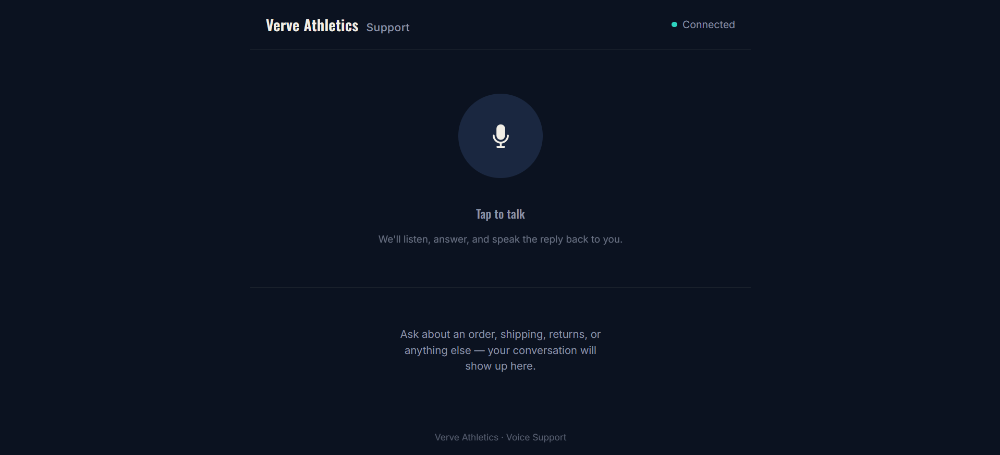
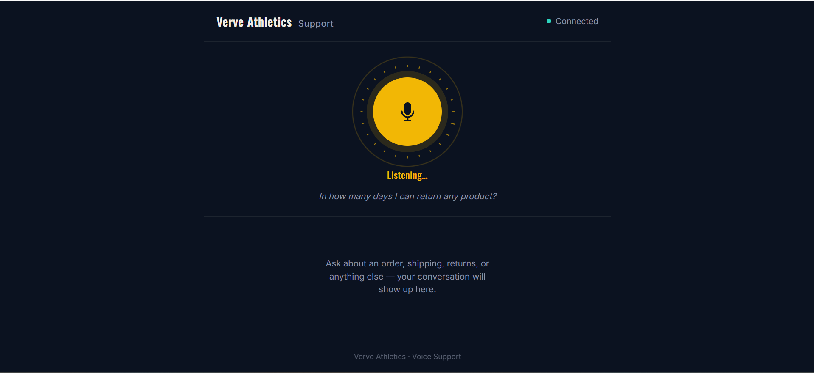
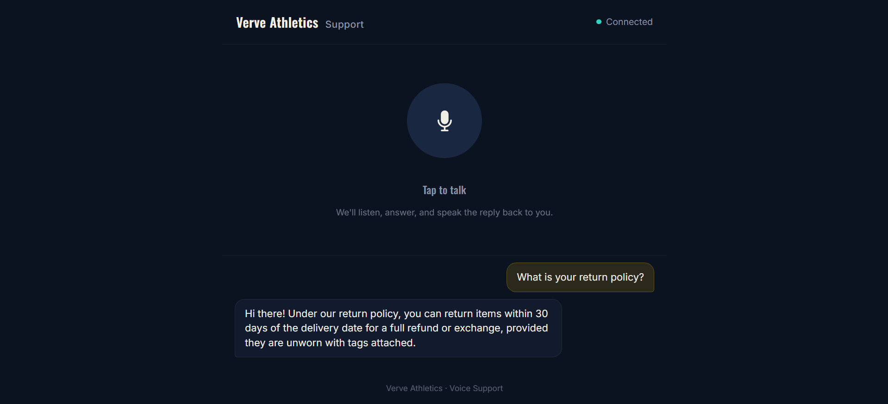
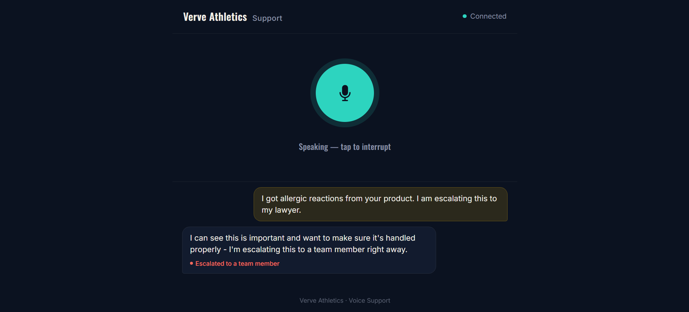

# Verve Athletics — Voice Support Agent

A voice-enabled AI customer support agent for **Verve Athletics**, a fictional
activewear brand. A customer speaks a question, it's transcribed in
real time, answered by a production-grade RAG pipeline, and spoken back
out loud — a full voice conversation loop, live at
**[verveassist.live](https://verveassist.live)**.

Built for the **AssemblyAI Voice Agent Hackathon** (lablab.ai), September 2026.

## What it does

- Real-time speech-to-text via **AssemblyAI**
- Answers generated by a **Gemini**-powered RAG pipeline over a FAISS-indexed
  policy knowledge base (shipping, returns, warranty, cancellation, account/payment)
- Spoken responses via **ElevenLabs** text-to-speech
- Shopify Admin API order lookups (order number + total verification)
- **Conflict detection** — if retrieved policy chunks genuinely contradict
  each other on the same point, the agent flags it and escalates to a
  human instead of guessing which source is right
- Multi-turn conversation state (e.g. collecting an order number, then a
  total, for verification)
- Per-session rate limiting to protect against runaway API spend
- Full web front-end: browser mic in, live transcript, spoken audio out

## Screenshots

| Idle | Listening |
|---|---|
|  |  |

| Answered | Escalation |
|---|---|
|  |  |

## Architecture

```
Browser mic → WebSocket → AssemblyAI (STT) → RAG pipeline (Gemini + FAISS)
                                                     ↓
Browser speaker ← WebSocket ← ElevenLabs (TTS) ← generated answer
```

Flask + Flask-SocketIO backend, using `gthread` workers (not eventlet/gevent
— the AssemblyAI SDK's real-OS-thread keepalive conflicts with green-thread
concurrency models). Deployed on AWS EC2 behind nginx, with Let's Encrypt SSL
(HTTPS is required for browser microphone access).

## What's reused vs. new

This project builds on the RAG/decision logic from an existing, separately
deployed text-based support agent for the same fictional brand — a prior
personal project — but is a completely separate codebase, not an
extension of it.

- **Reused from the prior project**: the core RAG pipeline (`app/core/`)
  — retrieval, conflict detection, Gemini-based answer generation, order
  lookup, routing, escalation logging — and the underlying policy
  knowledge base.
- **Entirely new for this hackathon**: the full voice layer — real-time
  STT integration, TTS integration, the WebSocket bridge connecting
  browser mic/speaker to the pipeline, the front-end, and the deployment
  infrastructure for this app.

Building the voice layer around a knowledge base already proven at 98%+
accuracy in production let the time budget go toward the actual
voice/conversational engineering — real-time transcription, low-latency
TTS, WebSocket audio streaming, concurrency handling, and deployment —
rather than reinventing policy retrieval from scratch.

## Conflict detection catches real errors

The RAG pipeline includes a dedicated conflict-detection step: if two
retrieved policy chunks make genuinely different factual claims about the
same specific point, the agent doesn't guess which one is right — it
flags the discrepancy and escalates to a human. During this hackathon's
deployment testing, this caught a real contradiction between two policy
documents (a 24-hour vs. 1-hour cancellation window) that had been
sitting unnoticed in the knowledge base — a genuine discrepancy the
system found and surfaced on its own.

## Tech stack

- **STT**: AssemblyAI real-time streaming
- **LLM**: Google Gemini
- **TTS**: ElevenLabs
- **Retrieval**: FAISS
- **Backend**: Flask, Flask-SocketIO, gunicorn (gthread workers)
- **Frontend**: vanilla JS, WebSocket audio streaming
- **Infra**: AWS EC2, nginx, systemd, Let's Encrypt (Certbot)
- **Commerce**: Shopify Admin API

## Running locally

```bash
python -m venv venv
source venv/bin/activate  # or venv\Scripts\activate on Windows
pip install -r requirements.txt
# create a .env with GEMINI_API_KEY, ASSEMBLYAI_API_KEY, ELEVENLABS_API_KEY,
# SHOPIFY_STORE_DOMAIN, SHOPIFY_ACCESS_TOKEN, FLASK_SECRET_KEY
python app/api/server.py
```

Then open `http://localhost:5000`. Note: browser microphone access requires
HTTPS on any non-localhost origin — `localhost` is exempted, which is why
local development works without SSL.

## License

Built for a hackathon submission. Not for commercial use.
